# Gaston Galeano

Fullstack Developer | .NET & React
Montevideo, Uruguay

Looking for a job :P

- Programming mainly with .NET.
- Interested in backend design and API development.
- Always improving through real projects.

<div style="display: flex; flex-direction: column; align-items: center; gap: 10px;">
    <div style="display: flex; justify-content: center; gap: 10px; width: 100%;">
        
        
    </div>
    <div style="width: 70%;">
        
    </div>

</div>
## Tech stack

```txt
Backend:   .NET, ASP.NET Core, C#, REST APIs
Frontend:  React, TypeScript, JavaScript, HTML, CSS
Database:  SQL Server, PostgreSQL
Tools:     Git, GitHub, Docker, VS Code
```

## Contact

```txt
Email: gaston.galeano.r@gmail.com
```